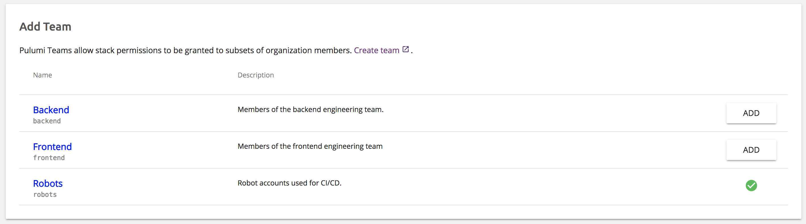
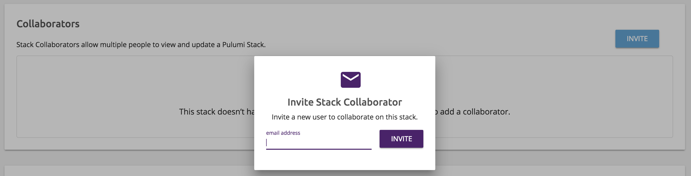

The Pulumi Cloud Console offers multiple ways for people to collaborate on a
stack. However, some may not be available depending on the type of organization
the stack resides in.

## Teams

Teams allow organization admins to assign permissions to access a group of stacks
to a group of users.

The ability to create teams in the Community and Standard Editions of the Pulumi
Cloud Console is limited to organizations imported from GitHub. The Enterprise
Edition supports alternative identity providers.

### Adding a Team

You can add a new team by going to the organization's TEAMS tab, and then
clicking the NEW button. Only organization admins can create or update teams.

Similar to importing a GitHub organization into Pulumi, teams are imported from
GitHub. To create a new team, simply create one within the backing GitHub
organization and then import it within the Pulumi Cloud Console.

The membership of a Pulumi team is managed on GitHub, while set of stack
permissions granted to team members is managed on the Pulumi Cloud Console.

## Stack Collaborators

Stack collaborators are Pulumi users who have been explicitly invited to
collaborate on a stack.

> The ability to add stack collaborators is limited to just user organizations.
> When using organizations imported from GitHub, teams should be used instead.

### Inviting Collaborators

To invite a stack collaborator, navigate to the stack's SETTINGS page. There,
the administrator of the user organization (i.e. _you_) will see an INVITE
button.

Stack collaborators are added by email. They will recieve a requested to accept
the invite, and only then be granted access to the stack. The invite will
expire and no longer be available after five days.

All stack collaborators are given `WRITE` permission to the stack.
