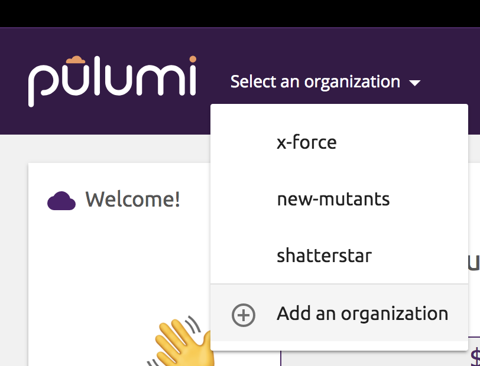
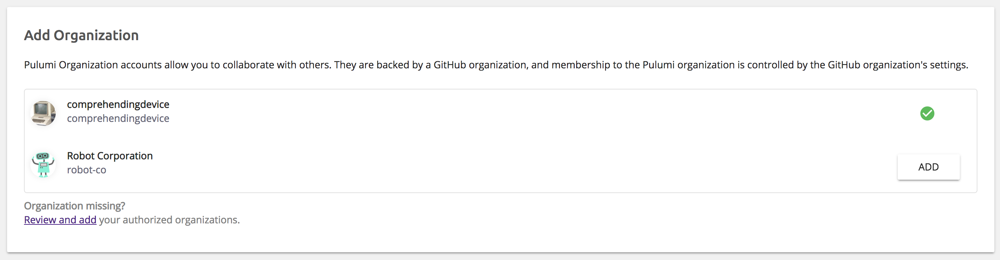

[The Pulumi Cloud Console](https://app.pulumi.com) allows you to manage your stacks online. It enables
you to to collaborate with multiple developers, protect against concurrent updates, store resource
history, integrate with your CI/CD system, and more!

## Getting Started

To get started using the Pulumi Cloud Console, go to [app.pulumi.com](https://app.pulumi.com) and
sign in with your GitHub account.

> Support for more kinds of identity providers is coming soon to the Team Edition, and available
> for privately hosted Enterprise Edition instances. If you require an identity provider other than
> GitHub, please [contact us](https://www.pulumi.com/about/#contact-us).

## Organizations

The Pulumi Cloud Console manages stacks by placing them within _Organizations_.

When you first log in, a Pulum organization is created with the same name as your GitHub account.
That organization is implied whenever you run commands like `pulumi stack init` or
`pulumi stack select`. For example, `pulumi stack init my-devstack` will create a new stack in
the organization associated with your GitHub account. e.g. `octocruise/my-devstack`.

To create or select a stack in a different organization, prefix it with the organization's name
followed by a slash. For example, `pulumi stack init robot-co/new-service`.

### Creating New Organizations

You can create new Pulumi organizations by importing them from GitHub. This
allows you to collaborate with other developers using the Pulumi Cloud Console
while using the organization membership data from GitHub.

To create a new Organization, select the _"Add an organization"_ item from the
orgnaizations dropdown on the top left.

{:width="400px"}

The new organizations page shows you a list of GitHub organizations that you
are an owner of. If you would like to add a GitHub organization to Pulumi but
it is not found in the list, you will need to click _"Review and add"_ to
grant the Pulumi Cloud Console access to the GitHub organization.

> **GitHub OAuth Scopes**
>
> Adding an Organization to Pulumi requires the `read:org` scope. Pulumi
> requires this scope in order to only grant access to members of the GitHub
> organization.
>
> Pulumi will not have access to any of your GitHub repositories, and will only
> have access to organization membership information for the organizations to
> which you've granted access.

## Roles and Access Controls

Pulumi organizations allow managing member access to stacks. For examaple,
enforcing policy on who can create new stacks within an organization, or who
can update existing stacks.

For more information about organization roles, stack permissions, and how they
are managed in the Pulumi Cloud Console, see [Roles and Access Controls](./roles-and-access-controls.html).

## Collaboration

The Pulumi Cloud Console allows people to collaborate on stacks within
an organization, including role-based access using GitHub teams.

For more information on the types of collaobration supported, see
[Collaboration](./collaboration.html).
