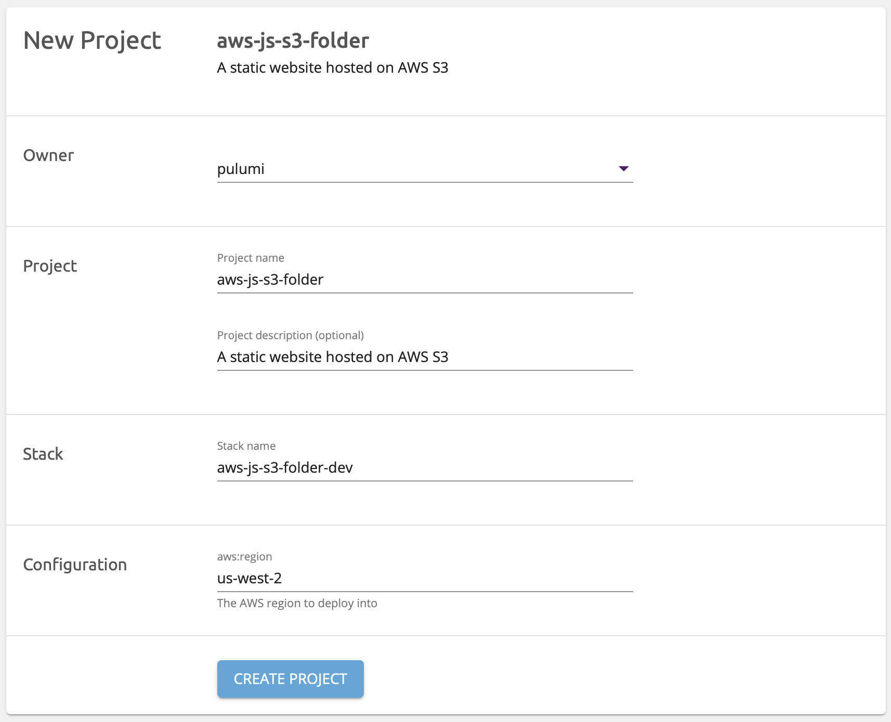

The 'Deploy with Pulumi' button provides a way to easily create new Pulumi projects within a web browser. The button can be embedded in README files in GitHub repositories/Gists, blog posts, or other web pages.

For example, the following button can be clicked to configure and create a new empty JavaScript project:

[](https://app.pulumi.com/new?template=https://github.com/pulumi/templates/javascript)

This document describes how you can create Pulumi buttons for your own Pulumi templates, examples, and apps.

There are two steps to create a button:

 1. Include optional template metadata in your `Pulumi.yaml`.
 2. Create a button in Markdown or HTML.

## Templates

The Pulumi button works with template projects hosted in public GitHub repositories or Gists. A template is a Pulumi project that has the required `Pulumi.yaml` file, which describes the project. The template project can be in the root of the GitHub repository or within a subdirectory. Multiple projects can be hosted within subdirectories of a single repository.

The `Pulumi.yaml` file can optionally contain a `template` section, which typically includes a `config` section used to specify any required config values for the project. Each config value can have a `description` and `default` value. Config values can also have a `secret` property, which can be set to `true` to indicate the config value is a [secret](../config.html#secrets).

```yaml
name: my-aws-project
runtime: nodejs
description: My AWS project description
template:
  config:
    aws:region:
      description: The AWS region to deploy into
      default: us-west-2
    myAccessToken:
      description: My access token
      secret: true
```

The above snippet includes an `aws:region` config value with a default value of `us-west-2`, as well as a `myAccessToken` config value that is a secret without a default value.

### Testing

You can test your template project with the [Pulumi CLI](https://pulumi.io/quickstart/install.html) or a web browser.

CLI:

```bash
$ pulumi new https://github.com/pulumi/examples/aws-js-s3-folder
```

Browser:

```
https://app.pulumi.com/new?template=https://github.com/pulumi/examples/aws-js-s3-folder
```



## Creating a Pulumi Button

After you've verified your template project works as expected, you can add a button to the README in your repository or Gist.

There are two ways of referencing the template project:

 - Implicitly without a `template` parameter. For public GitHub repositories or Gists, if you don't specify a `template` parameter, Pulumi will infer the URL to the template using the HTTP `referer` header that is sent when the button is clicked. This makes the button stable under forks and branches of the repository.

 - Explicitly specifying a `template` parameter that points to the project. This is useful for buttons that aren't inside a repository, such as in blog posts or other web pages, or when the README isn't in the same directory as the template project.

### Implicit templates

If you're embedding the button in the README of a public GitHub repo or Gist, Pulumi will automatically infer the URL to the template from the `referer` header that is sent when the button is clicked.

> This is convenient because it avoids hard-coding the specific repository URL into the button, allowing forks and branches of the repository to work without needing to change the button's `template` parameter.

Here's an example in Markdown:

```markdown
[](https://app.pulumi.com/new)
```

Or, the equivalent HTML:

```html
<a href="https://app.pulumi.com/new">
  
</a>
```

A `button.png` is also available.

### Explicit templates

Alternatively, the `template` parameter can be specified explicitly.

Here's an example in Markdown:

```markdown
[](https://app.pulumi.com/new?template=https://github.com/pulumi/examples/aws-js-s3-folder)
```

Or, the equivalent HTML:

```html
<a href="https://app.pulumi.com/new?template=https://github.com/pulumi/examples/aws-js-s3-folder">
  
</a>
```

### Button image

Pulumi provides both SVG and PNG versions of the button image at the following URLs:

 - `https://get.pulumi.com/new/button.svg`
 - `https://get.pulumi.com/new/button.png`

## Custom Git branches

You can use a fully qualified GitHub URL with the `template` parameter to reference the template at a specific Git branch, tag, or commit:

```
https://github.com/pulumi/examples/tree/master/aws-js-s3-folder
```
