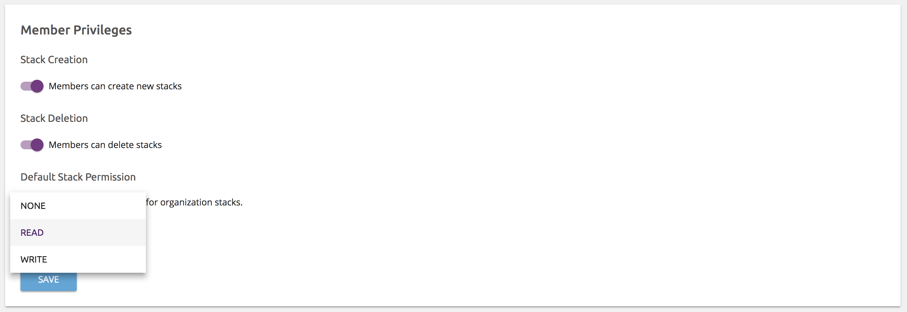

The Pulumi Cloud Console provides fine-grained access controls for stacks.

A user's permission to access a stack is based first on their role within the containing
organization, and then on any additional permissions granted explicitly to that user.

> Note: This feature is only available on organizations using the Pulumi Team Edition.
> For more information, see [Pulumi Editions](./editions.html).

## Organization Roles

Each member of a Pulumi Cloud Console organization has either the `MEMBER` or
`ADMIN` role within an organization.

Pulumi organizations that have been imported from GitHub carry along each
member's GitHub role. Members of the GitHub organization with the _Owner_
role on GitHub will have the `ADMIN` role in the Pulumi organization.

## Stack Permission Levels

There are three types of permission levels available to users and teams
collaborating on Pulumi stacks. For information on how to grant stack
permissions, see [Collaboration](./collaboration.html).

- `READ`
- `WRITE`
- `ADMIN`

These stack permissions allow users to perform the following actions:

| Action | `READ` | `WRITE` | `ADMIN` |
|--------|--------|---------|---------|
| View update history | ✅ | ✅ | ✅ |
| Decrypt secret configuration | ✅ | ✅ | ✅ |
| Read stack resources | ✅ | ✅ | ✅ |
| Preview stack changes | ✅ | ✅ | ✅ |
| Update stack | | ✅ | ✅ |
| Destroy stack (`pulumi destroy`) | |   | ✅ |
| Export stack checkpoint | ✅ | ✅ | ✅ |
| Import stack checkpoint |  | ✅ | ✅ |
| Delete stack (`pulumi stack rm`) | | | ✅ |

## Organization Settings

Pulumi organizations that have been imported from GitHub can be configured by
organization admins to change way organization members interact with stacks.

### Default Stack Permission

Any organization member with the `ADMIN` role automatically has `ADMIN`
permission for all of the organization's stacks. Regular organization members
are granted the organization's _default stack permission_ instead.

For example, if the organization's default stack permission is `WRITE`, then
any organization member can update any organization stack.

If the default stack permission is `NONE`, then organization members must be
granted access using teams in order to update, or even view organization
stacks. (See [Collaboration](./collaboration.html) for more information.)

### Stack Creation

Pulumi organization admins can configure whether or not the organization
allows members to create new stacks.

If enabled, any organization member can create a new stack. Otherwise, only
organization admins can.

When a stack is created within an organization, the creating user is added as
a stack collaborator with `ADMIN` permission. Just like any other stack
collaborator however, an organization admin can remove that `ADMIN` access
later.

### Stack Deletion

Similar to stack creation, Pulumi organization admins can configure whether
or not organization members can delete stacks.

If enabled, any organization with `ADMIN` permission on the stack can delete
it. Otherwise, only organization admins can.
