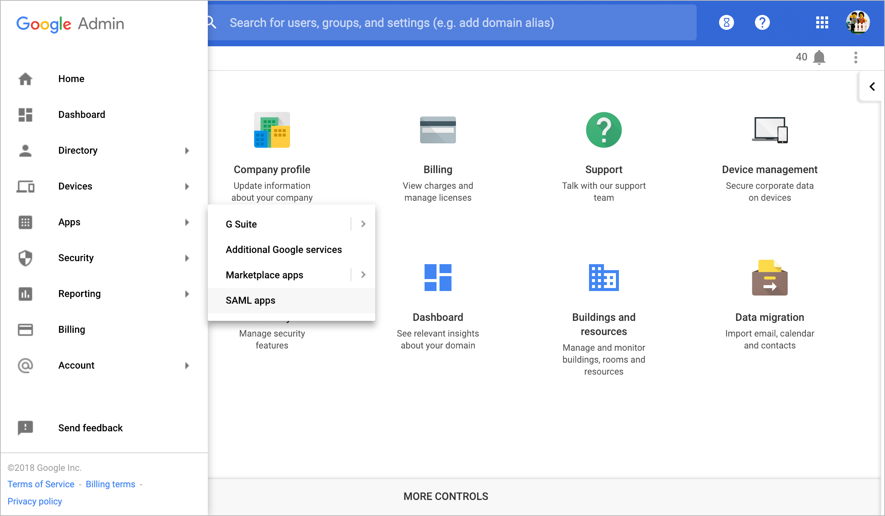
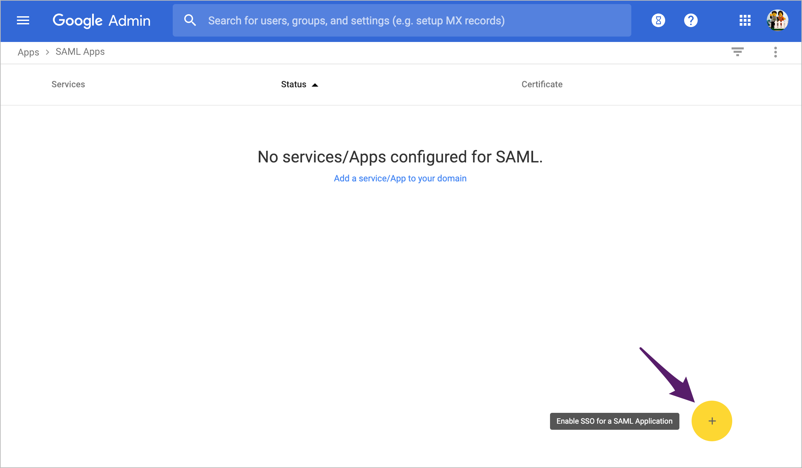
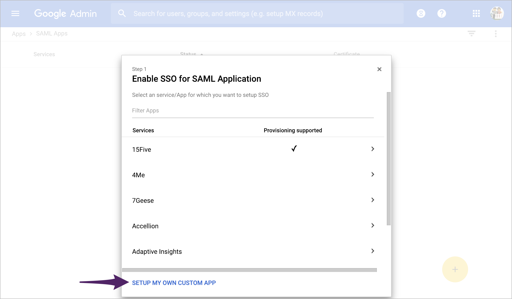
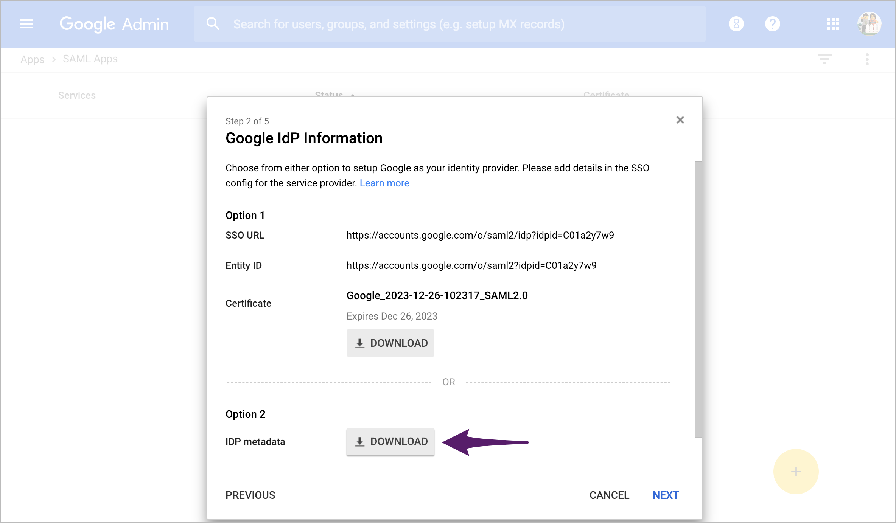
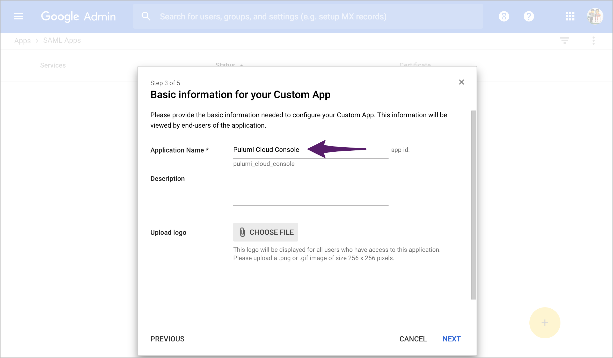
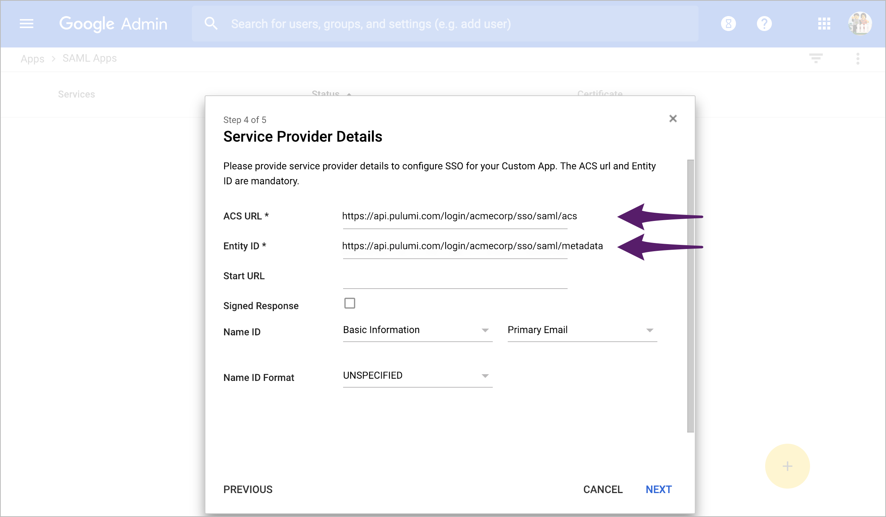
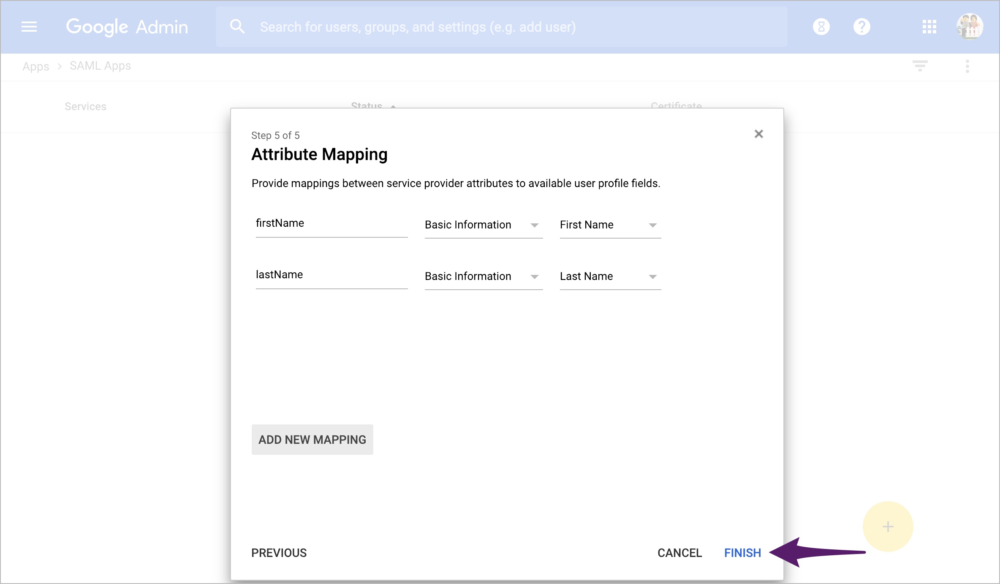
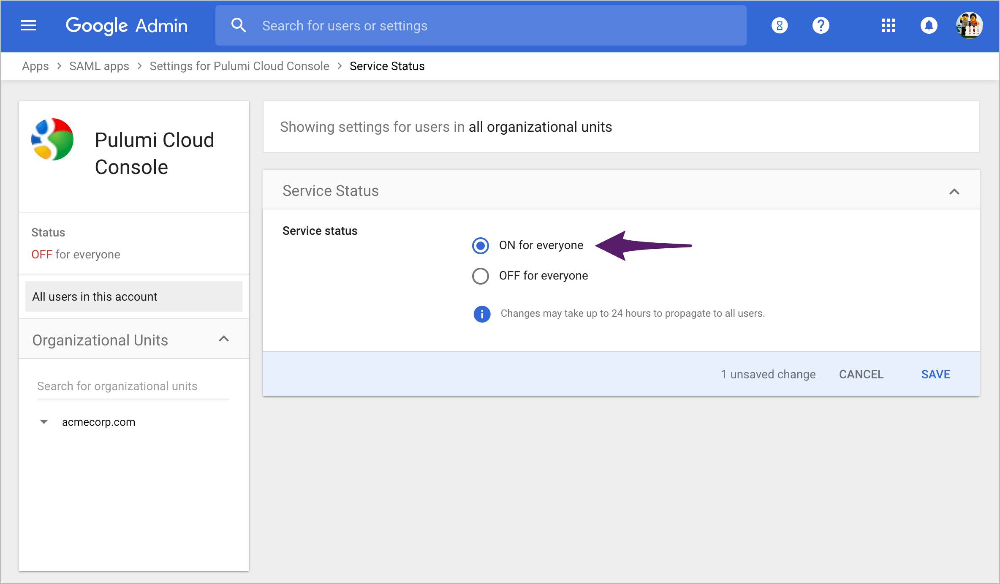
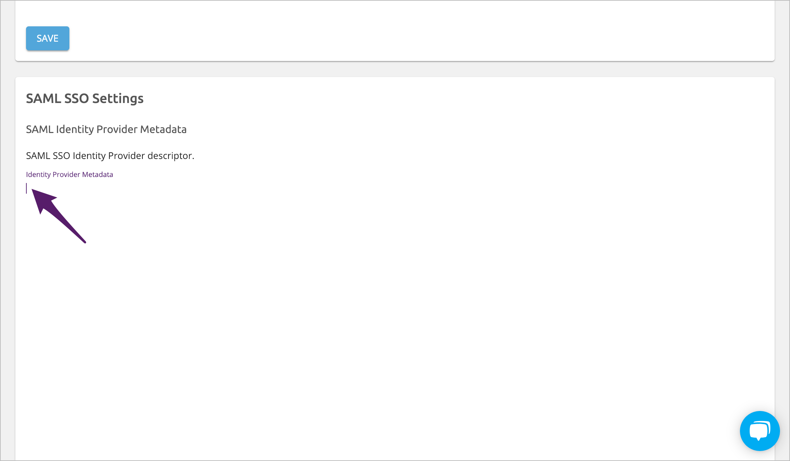
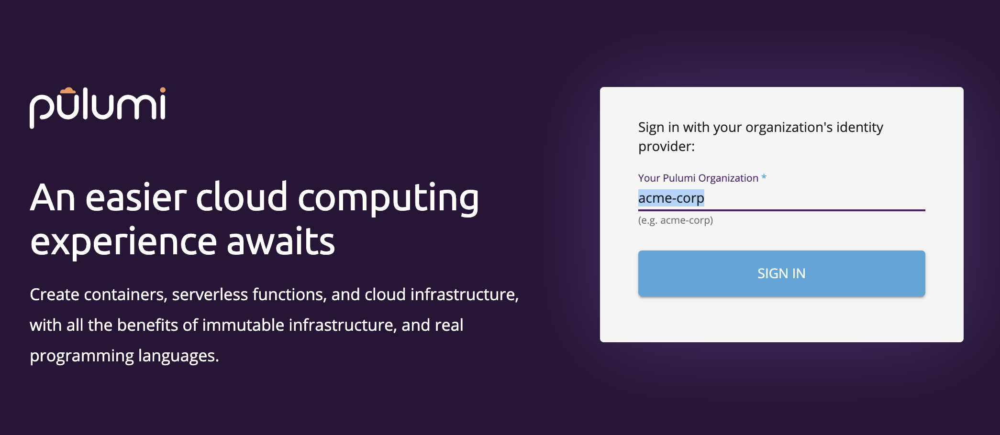

This guide explains how to configure your G Suite service as a SAML SSO identity provider
(IDP) for use with the Pulumi Cloud Console.

## Creating the SAML Application

1. In the [administrator console](https://admin.google.com/) for your G Suite domain, open the flyout menu
in the upper-left corner and choose **Apps &gt; SAML Apps**.

    

1. Click the **+** symbol in the lower-right corner to create a new SAML application.

    

1. In the first step, click **Set Up My Own Custom App**.

    

1. Next, choose **Option 2: Download IDP Metadata** to download an XML document that identifies
and describes your G Suite domain as a SAML identity provider. We'll use this document later
to complete the process of configuring your Pulumi organization. For now, note the location of
the downloaded file, then click **Next** to continue.

    

1. Give your SAML application a name such as _Pulumi Cloud Console_ and an optional description
and logo, then click **Next**.

    

1. In step 4, for the required **ACS URL** and **Entity ID** fields, enter the fully-qualified
URLs of the `acs` and `metadata` endpoints of the Pulumi API, adjusted for your Pulumi organization name. For example, if your
Pulumi organization were `acmecorp`, those values would be:

    * ACS URL: `https://api.pulumi.com/login/acmecorp/sso/saml/acs`
    * Entity ID: `https://api.pulumi.com/login/acmecorp/sso/saml/metadata`

    

   Leave the other fields as their default values, then click **Next**.

1. The final step, attribute mapping, is optional, but you may wish to use it to specify proper
first and last names for your Pulumi users, based on their Google account profiles. The Pulumi service
expects to receive these fields as as `firstName` and `lastName`, respectively.

    Add them if you like, then click **Finish** and **OK** to confirm.

    

1. Finally, on the screen that follows, enable your newly created SAML application for your Google
domain users:

    

   Click **Save** to complete.

   At this point, you're done configuring G Suite, and can move on to completing SAML SSO setup in
   the Pulumi Cloud Console.

## Configuring Your Pulumi Organization

The final step in the process consists of associating your Pulumi organization with your SSO identity
provider.

1. Sign into the Pulumi Cloud Console where your SAML organization resides (e.g.,
[https://app.pulumi.com](https://app.pulumi.com)), then navigate to the **Settings** tab for that
organization.

1. Scroll to the SAML SSO Settings section, click into the **Identity Provider Metadata** field, and
paste into that field the full contents of the XML IDP document you downloaded above.

    

    For example:

1. Click **Save**.

Your Pulumi organization is now configured to use Google as a SAML SSO identity provider.

## Signing into Pulumi with Google

Members of your G Suite can now sign into Pulumi. Navigate to
[https://app.pulumi.com/signin/sso/](https://app.pulumi.com/signin/sso/) and enter the
name of your Pulumi organization.

## Troubleshooting

If you have any trouble configuring G Suite, signing into Pulumi, or need additional assistance, please
[contact us](https://www.pulumi.com/about/#contact-us).
