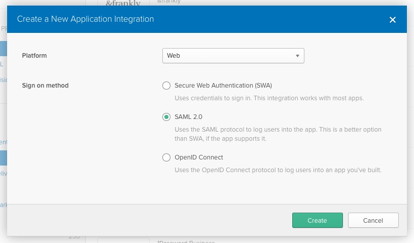
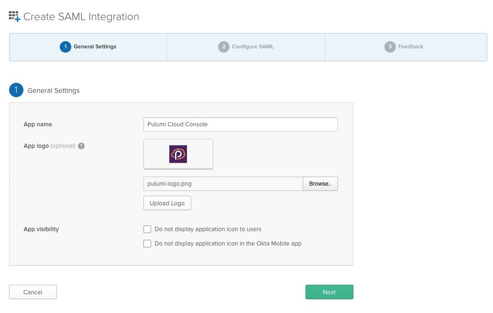
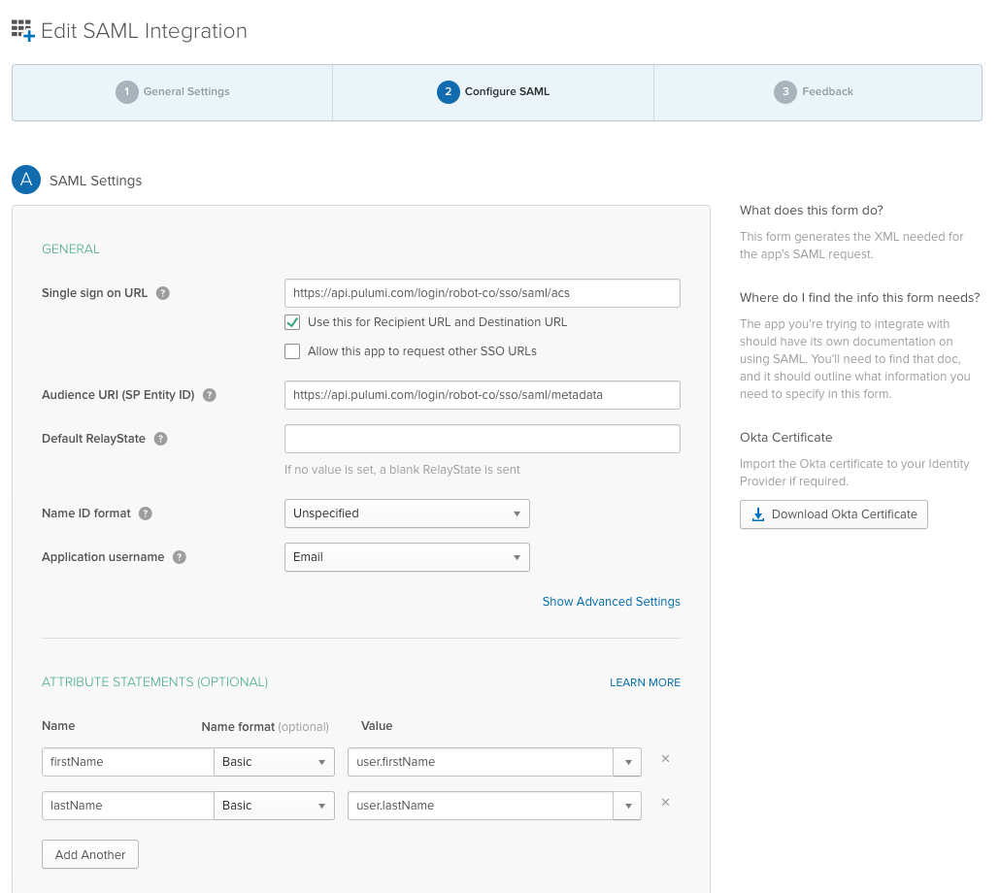
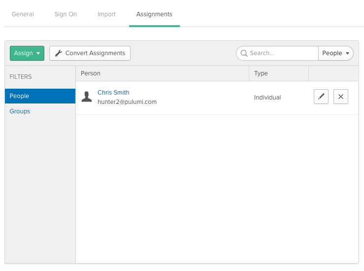
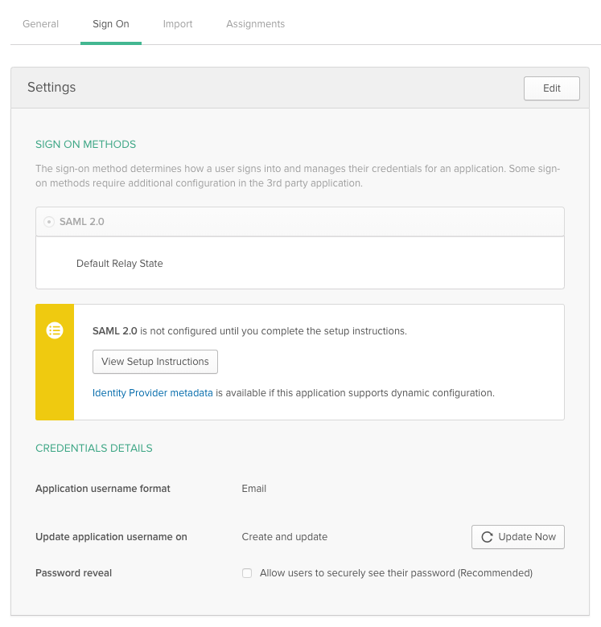
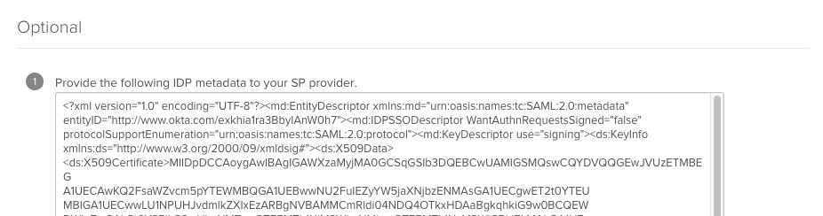
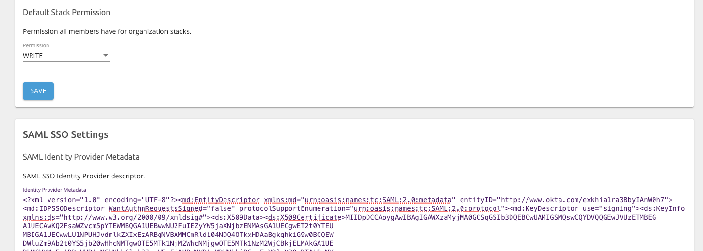

This guide walks through how to configure Okta as a SAML SSO identity provider (IdP) for use with
the Pulumi Cloud Console.

> The screen shots below are using the Okta _Classic UI_. You can switch to it by clicking the gear
> icon in the top right of the screen.

## Creating the Okta Application

The first step is to create a new Okta Application Integration. Of the various "sign on methods"
available, choose "SAML 2.0".

### Configuring the Application

Next you will be guided through a wizard to configure the Okta application. The first step is to
give it a name, e.g. "Pulumi Cloud Console", and an icon.

The next step is where you configure the SAML application's settings. The values to provide will
depend on the name of your Pulumi organization, e.g. `robot-co` or `acme`.

> [Contact us](https://www.pulumi.com/about/#contact-us) to provision the SAML-backed Pulumi
> organization for you to associate with Okta.

| General Setting | Value |
| --------------- | ----- |
| Single sign on URL | https://api.pulumi.com/login/robot-co/sso/saml/acs |
| Audience URI | https://api.pulumi.com/login/robot-co/sso/saml/metadata |
| Name ID format | Unspecified |
| App username | Email |

In addition, there are two attribute statements that can optionally be provided so that users
who log in with their Okta credentials will have proper user names.

| Attribute | Value | 
| --------- | ----- |
| firstName | user.firstName |
| lastName  | user.lastName  |

### User Assignments

After the Pulumi SAML application has been created in Okta, the next step is to assign users to it.
This will grant specific users or groups access to sign into Pulumi using their Okta-provided
credentials.

To assign users or groups to the application, navigate to the "Assignments" tab on the application
page.

## Configuring the Pulumi Cloud Console

The final step is to configure the Pulumi Cloud Console with the details about your new Okta-based
SAML application. To do this, you need to obtain the IDP metadata document from Okta and then provide
it to Pulumi.

First, navigate to the "General" tab on the application page and click the "View setup instructions"
page.

Next, scroll to the bottom of the setup instructions and select the value in the large text box
with the heading "Provide the following IDP metadata to your SP provider". That's the full SAML
Identity Provider SSO descriptor, which contains all of the settings Pulumi needs to verify
a user's identity.

With the block of XML text in your clipboard, navigate to your SAML organization's page on the
Pulumi Cloud Console. The exact URL depends on the name of the organization, but it will be
something like:
https://app.pulumi.com/robot-co/settings

On the organization setting's page, paste the IDP metadata descriptor into the bottom card
titled "SAML SSO Settings". Then click the "SAVE" button at the bottom of the card.

Once the IDP metadata descriptor has been saved, you are all set to log into to Pulumi.

### Logging in

To log into the Pulumi Cloud Console using your Okta-based credentials, navigate to a SAML-specific
login page for your organization. For example:

https://app.pulumi.com/welcome/robot-co/sso

## Troubleshooting

If you run into any troubles configuring Okta, logging into Pulumi, or need some assistance please
[contact us](https://www.pulumi.com/about/#contact-us).
